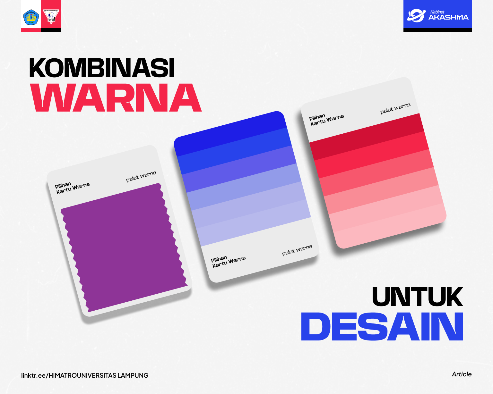

cd D:
Pindah ke drive D:

cd project
Masuk ke folder "project"

cd PPW
Masuk ke folder "PPW"

mkdir ppwta2
Membuat folder baru bernama "ppwta2"

cd ppwta2
Masuk ke folder "ppwta2"

git clone https://github.com/XymphonyS2/PPW-TUGAS-AKHIR-1.git
Clone/download repository dari GitHub (PPW-TUGAS-AKHIR-1)

cd PPW-TUGAS-AKHIR-1
Masuk ke folder hasil clone

code .
Membuka VS Code di folder ini

rm -r .git
Menghapus folder .git (menghilangkan history git dari repo lama)

git init
Inisialisasi git baru (membuat repository git baru dari awal)

ls -la
Melihat semua file termasuk yang hidden (untuk memastikan .git baru sudah ada)

git add .
Menambahkan semua file ke staging area

git commit -m "dasar"
Commit pertama dengan pesan "dasar"

git log
Melihat history commit

git remote add origin https://github.com/XymphonyS2/PPW-TUGAS-AKHIR-2.git
Menghubungkan repository lokal dengan repository remote baru (PPW-TUGAS-AKHIR-2)

git remote -v
Verifikasi remote URL yang sudah ditambahkan

git push -u origin master
Push commit ke branch master di GitHub (upload ke remote)

git checkout -b hapus-folder-tampilan
Membuat branch baru bernama "hapus-folder-tampilan" dan pindah ke branch tersebut

rm -r tampilan
Menghapus folder "tampilan" beserta isinya

ls -la
Mengecek isi folder (memastikan folder "tampilan" sudah terhapus)

git add .
Menambahkan perubahan (penghapusan folder) ke staging area

git commit -m "hapus folder tampilan"
Commit dengan pesan "hapus folder tampilan"

git checkout master
Kembali ke branch master

git merge hapus-folder-tampilan
Menggabungkan perubahan dari branch "hapus-folder-tampilan" ke master

git branch -d hapus-folder-tampilan
Menghapus branch "hapus-folder-tampilan" (karena sudah tidak diperlukan)

git checkout -b tamBah-porto
Membuat branch baru "tampah-porto" (ada typo, seharusnya "tambah-porto") dan pindah ke branch tersebut

git add .
git commit -m "update-index-porto"
1 file changed, 18 insertions(+)
Commit pertama di branch ini - mengubah 1 file (index.html), menambah 18 baris kode

git add .
git commit -m "update-index-porto2"
3 file changed, 0 insertions(+), 0 deletions(-)
create mode 100644 foto/7.png
create mode 100644 foto/8.png
create mode 100644 foto/9.png
Commit kedua - menambahkan 3 file gambar baru (foto 7, 8, 9) tanpa mengubah baris kode yang ada

git checkout master
Kembali ke branch master

git merge tambah-porto
Menggabungkan perubahan dari branch "tambah-porto" (bukan "tampah-porto") ke master

mengubah isi file index.html di github langsung
                

                    
                    

                        <h3>Project 7</h3>
                    

                

                

                    
                    

                        <h3>Project 8</h3>
                    

                

                

                    
                    

                        <h3>Project 9</h3>
                    

                

Edit file index.html langsung di website GitHub (bukan di komputer lokal)
Menambahkan 3 div untuk portfolio item (Project 7, 8, 9) dengan gambar 7.png, 8.png, 9.png

commit dengan nama update-index-porto3
Commit di GitHub dengan pesan "update-index-porto3"

git pull origin master
Download/pull perubahan dari GitHub ke komputer lokal (sinkronisasi dengan perubahan yang dibuat di GitHub)

mengubah isi file index.html di vscode
                

                    
                    

                        <h3>Project 10</h3>
                    

                

                

                    
                    

                        <h3>Project 11</h3>
                    

                

                

                    
                    

                        <h3>Project 12</h3>
                    

                

Edit file index.html di komputer lokal menggunakan VS Code
Menambahkan 3 div untuk portfolio item (Project 10, 11, 12) dengan gambar 10.png, 11.png, 12.png

git push origin master
Mencoba push ke GitHub (GAGAL karena GitHub sudah lebih ahead)

git pull origin master
Pull untuk mengambil perubahan dari GitHub sebelum bisa push

terdapat konflik
                    
                    
                          <h3>Project 7</h3>
                          <h3>Project 10</h3>
                    
                    
                          <h3>Project 8</h3>
                          <h3>Project 11</h3>
                    
                    
                          <h3>Project 9</h3>
                          <h3>Project 12</h3>
Git mendeteksi konflik karena baris yang sama diubah di dua tempat berbeda (GitHub dan lokal)
Konflik yang muncul:
- GitHub menambahkan Project 7, 8, 9
- Lokal menambahkan Project 10, 11, 12
- Keduanya menambahkan kode di lokasi yang sama dalam file

Git menampilkan kedua versi:
    ← dari GitHub
   ← dari lokal
<h3>Project 7</h3>            ← dari GitHub
<h3>Project 10</h3>           ← dari lokal
Dan seterusnya untuk Project 8-11 dan 9-12

menghilangkan konflik
                     (HILANG)
                     (HILANG)
                          <h3>Project 7</h3> (HILANG)
                          <h3>Project 10</h3> (HILANG)
                     (HILANG)
                     (HILANG)
                          <h3>Project 8</h3> (HILANG)
                          <h3>Project 11</h3> (HILANG)
                     (HILANG)
                     (HILANG)
                          <h3>Project 9</h3> (HILANG)
                          <h3>Project 12</h3> (HILANG)
Menghapus SEMUA kode yang berkonflik (baik dari GitHub maupun lokal)
Semua baris yang ditandai (HILANG) dihapus, termasuk:
Project 7, 8, 9 (dari GitHub)
Project 10, 11, 12 (dari lokal)

git add .
Menambahkan file yang sudah diresolusi ke staging area

git commit -m "update-index-porto4"
1 file changed, 6 deletions(-)
Commit resolusi konflik - 1 file berubah, 6 baris dihapus

git add .
git commit -m "update-index-porto5"
2 file changed, 9 insertions(+), 3 deletions(-)
Commit tambahan - 2 file berubah, 9 baris ditambah, 3 baris dihapus
Commit ini mengubah HTMK dan CSS
